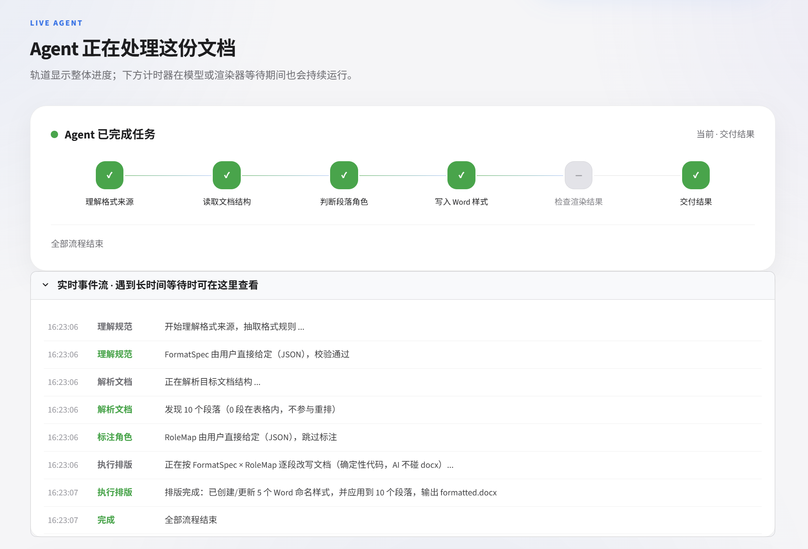
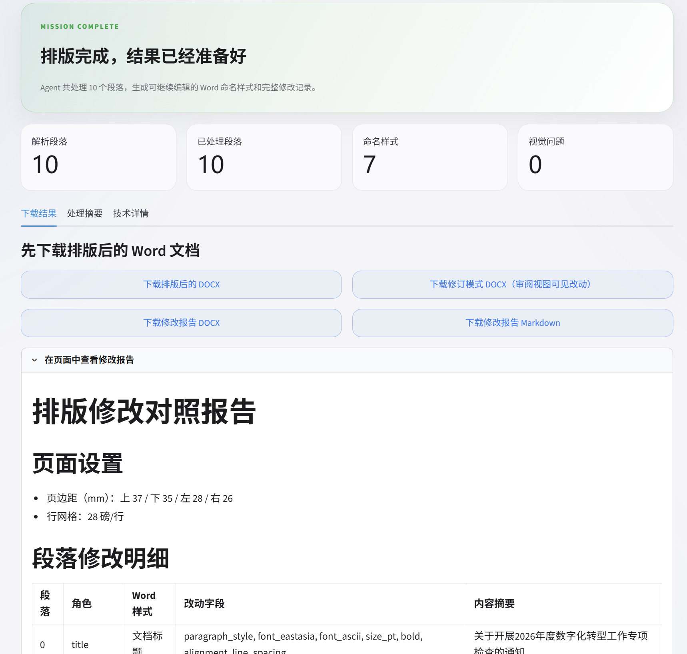
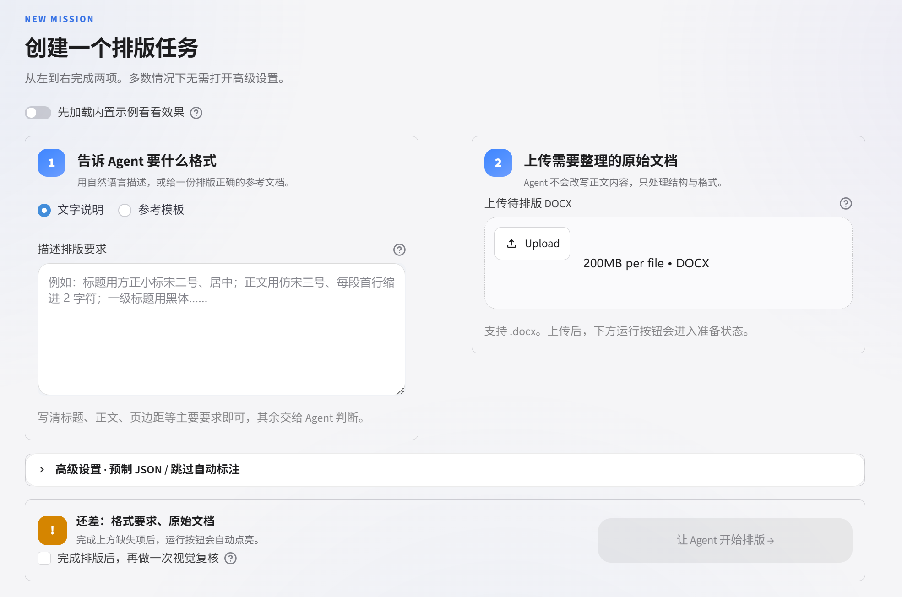

# 格式排版 Agent（Format Agent）

> **本仓库为黑客松完整版（GUI 演示界面 + 演示案例 + 路演页），已归档。**
> 日常使用的 Skill 版本已独立成库，请移步 **[format-agent-skill](https://github.com/KaguraNanaga/format-agent-skill)**——仓库即技能，clone 即可安装。

> 理解归 AI，动手归代码，中间用 JSON 交接。

给它一份**格式规范**（自然语言规范文字，或一份排好版的 Word 模板），再给它一份**格式混乱的 docx**——Agent 自主完成理解规范、识别文档结构、逐段改写格式，输出可直接交付的 Word 文档。


## 为什么做

公文、汇报、论文都有严格的排版规范，但排版至今是纯体力活：字体字号、行距缩进、标题层级、编号体例，几十页文档逐段手调。而"规范"往往只存在于老师傅的经验或一份没人细看的模板里。

## 核心设计：两个 JSON 的契约

LLM 在系统里**只被允许产出两个结构化结果，永远不直接碰 docx**：

```
格式来源（规范文字 / Word 模板）
        │  ① 规则理解（LLM / 确定性读取）
        ▼
   FormatSpec（格式规则 JSON）◄── schema 校验，失败回喂自我修正
        │
目标 docx ── ② 结构抽取（python-docx）──► 段落清单
        │                                    │
        │            ③ 角色标注（编号惯例确定性识别 + LLM 语义兜底）
        │                                    ▼
        │                            RoleMap（段落角色 JSON）
        ▼                                    │
  ④ 执行器（确定性代码，写入 Word 命名样式）◄─┘
        │
        ▼
排版后 docx + 修订模式 docx + 修改对照报告 + （可选）视觉自检
```

这样的好处：

- **零幻觉风险**：模型输出被 JSON Schema 严格约束，改文档的每一刀都是代码落的
- **可继续编辑**：格式写入 Word 命名样式，不是刷死的直接格式
- **可审计**：修订模式文档在 Word 审阅视图里逐条接受/拒绝每处改动
- **可兜底**：模型不可用时，两个 JSON 可人工给定，走完全确定性的降级链路



## 能力矩阵

| 格式来源 \ 目标文档 | 纯文本无结构 | 有序号 / 自动编号 |
|---|---|---|
| **自然语言规范文字** | LLM 语义理解段落角色 | 编号惯例确定性判级，省模型调用 |
| **Word 模板** | 脚本直读模板样式 + LLM 标注 | 自动编号 XML 识别（文字里根本没有序号也能判） |

真实世界的硬骨头都接住了：手工编号、Word 自动编号、取消编号残留、长句正文误标标题、模板未规定的角色与正文自动保持一致。

## 输出产物

每次排版产出四样东西：

| 产物 | 说明 |
|---|---|
| `排版后.docx` | 命名样式写入的干净稿 |
| `排版后_tracked.docx` | **修订模式**：Word 审阅视图可见每处格式改动 |
| `排版后_report.docx` / `.md` | 段落级修改对照报告 |
| `_formatspec.json` / `_rolemap.json` | 中间产物，Agent 的"理解证据" |



## 快速开始

环境：Python 3.10+；Windows（Word COM 渲染）或 macOS/Linux（LibreOffice 渲染）。

```bash
pip install -r requirements.txt
```

配置模型（OpenAI 兼容端点，写在 `.env` 或环境变量里）：

```bash
LLM_BASE_URL=https://你的端点/v1
LLM_API_KEY=你的key
LLM_MODEL=你的模型
# 可选：LLM_VISION_MODEL / LLM_TIMEOUT / LLM_TEMPERATURE
```

> **建议使用多模态模型**（同时支持文本与图像输入，如 GPT-4o、Kimi K3、Qwen-VL、GLM-4V 等）。
> 排版主流程只需文本能力，但"视觉自检"要把渲染图交给模型质检——
> 多模态模型一套配置全搞定，纯文本模型则无法开启视觉自检。

### 命令行

```bash
# 规范文字作为格式来源
python main.py --spec assets/spec.txt --target assets/messy.docx --out out/排版后.docx

# Word 模板作为格式来源
python main.py --template assets/party_meeting.docx --target assets/messy.docx --out out/排版后.docx

# 排版后再做一轮视觉自检（需视觉模型）
python main.py --spec assets/spec.txt --target assets/messy.docx --out out/排版后.docx --verify
```

### 作为 Skill 接入你的 Agent（推荐）

本项目同时是一个自包含的 Agent Skill（`skills/format-agent/`）。不需要部署任何界面，
直接把仓库链接发给你的 Agent 即可安装调用，例如对它说：

> 帮我安装这个 skill：https://github.com/KaguraNanaga/format-agent-01/tree/main/skills/format-agent
> 然后按《规范文字.txt》的要求，把"待排版.docx"重排一下。

Agent 会读取其中的 SKILL.md，自行完成依赖安装、规范理解和排版执行，
产出排版稿、修订模式文档和修改对照报告。

国内用户常见的 Agent 环境（支持 Skill/插件机制）均可使用：
Kimi Code、腾讯 WorkBuddy、字节 Trae、阿里 Qoder、百度 Comate 等。

### 演示界面

```bash
streamlit run app.py
```

浏览器打开后可上传规范与文档，实时观看 Agent 的工作日志（理解 → 校验 → 自我修正 → 执行 → 自检），并下载全部产物。



### 无模型降级

模型不可用时，直接提供两个 JSON 走确定性链路：

```bash
python main.py --spec-json assets/spec_std.json --rolemap-json assets/rolemap_std.json \
    --target assets/messy.docx --out out/排版后.docx
```

## 演示案例（assets/demo/）

四个案例覆盖能力矩阵全象限，文体各异：

| 案例 | 文字结构 | 规范形式 | 文档 |
|---|---|---|---|
| case1 | 无结构 | 自然语言 | 新闻稿《智汇云平台2.0发布》 |
| case2 | 无结构 | Word 模板 | 项目周报（微软雅黑模板直读） |
| case3 | 手工序号 | 自然语言 | 课程论文（一、（一）、1. 三级标题） |
| case4 | Word 自动编号 | Word 模板 | 党委会议题议案（已脱敏为虚构主体） |

每个案例含：改前文档、格式规范（文字或模板）、改后文档、预览图、修订稿、对照报告。

## 项目结构

```
├── main.py               # CLI 入口（薄壳，走 core/agent.py）
├── app.py                # Streamlit 演示界面（工作日志直播 + 白/深主题）
├── core/                 # 流水线核心
│   ├── agent.py          # 事件流编排器
│   ├── llm.py            # OpenAI 兼容客户端（重试/降级/视觉）
│   ├── schema.py         # FormatSpec 校验器
│   ├── extract.py        # docx → 段落清单（生效属性/编号元数据）
│   ├── rules_from_text.py      # 规范文字 → FormatSpec
│   ├── rules_from_template.py  # Word 模板 → FormatSpec（确定性）
│   ├── label_roles.py    # 段落角色标注（编号惯例 + LLM）
│   ├── numbering.py      # 编号识别
│   ├── style_set.py      # Word 命名样式写入
│   ├── apply.py          # 执行器接线
│   ├── track_changes.py  # 修订模式（w:pPrChange / w:rPrChange）
│   ├── report_docx.py    # docx 对照报告
│   ├── verify_visual.py  # 视觉自检
│   └── render.py         # docx → PDF → PNG（Word COM / LibreOffice）
├── assets/demo/          # 四象限演示案例
├── skills/format-agent/  # 自包含技能包
├── roadshow/             # 路演页面
└── tests/                # 确定性测试（python tests/xxx.py 直接运行）
```

## 测试

```bash
python tests/test_outline.py            # 大纲级别与二级标题识别
python tests/test_list_role_detection.py # 编号正文与标题区分
python tests/test_style_pipeline.py      # 命名样式流水线
python tests/test_vision_pipeline.py     # 视觉自检（含模型连通性）
```
